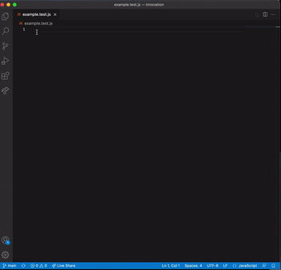

# Jest Better Snippets



<div>
  


  
</div>

Jest Better Snippets is my attempt at speeding up the development of test writing in the Javascript [Jest](https://jestjs.io/) framework. I primarily use vscode however I may try and port this to other IDEs such as Atom in the future.

Feel free to clone this and add whatever you want, or send me some ideas of things that you'd find helpful and I'll add them to the list.

### Testing 
The github repo associated with this extension tests the current snippets to make sure they all follow the same guidelines.

###### To Run
`npm i` &#10140; `npm test`

### Documentation
This documentation covers the raw commands and not the placeholders that are put in place. A lot of options that are not specified as async have the option to be async through tab stop placeholder.

#### Describe Snippets
|  Trigger | Content                       |
| -------: | ----------------------------- |
|  `des`   | `describe()`                  |
|  `dese`  | `describe.each()`             |
|  `deso`  | `describe.only()`             |
|  `dess`  | `describe.skip()`             |
|  `desa`  | `describe(async)`             |
|  `daa`   | `describe(afterAll())`        |
|  `daaa`  | `describe(afterAll(async))`   |
|  `dae`   | `describe((afterEach()))`     |
|  `daea`  | `describe(afterEach(async))`  |
|  `dba`   | `describe(beforeAll())`       |
|  `dbaa`  | `describe(beforeAll(async))`  |
|  `dbe`   | `describe(beforeEach())`      |
|  `dbea`  | `describe(beforeEach(async))` |
|  `di`    | `describe(it())`              |
|  `dia`   | `describe(it(async))`         |
|  `dt`    | `describe(test())`            |
|  `dta`   | `describe(test(async))`       |

#### It Snippets
|  Trigger | Content                 |
| -------: | ----------------------- |
|  `it`    | `it()`                  |
|  `ite`   | `it.each()`             |
|  `ito`   | `it.only()`             |
|  `its`   | `it.skip()`             |
|  `itt`   | `it.todo()`             |
|  `ita`   | `it(async)`             |
|  `itwe`  | `it(exepct())`          |
|  `it2`   | `it()` `it()`           |
|  `it2a`  | `it(async)` `it(async)` |

#### Test Snippets
|  Trigger | Content                     |
| -------: | --------------------------- |
|  `tes`   | `test()`                    |
|  `tese`  | `test.each()`               |
|  `teso`  | `test.only()`               |
|  `tess`  | `test.skip()`               |
|  `testt` | `test.todo()`               |
|  `tesa`  | `test(async)`               |
|  `twe`   | `test(expect())`            |
|  `t2`    | `test()` `test()`           |
|  `t2a`   | `test(async)` `test(async)` |

#### Setup/Teardown Snippets
|  Trigger | Content             |
| -------: | ------------------- |
|  `aa`    | `afterAll()`        |
|  `aaa`   | `afterAll(async)`   |
|  `ae`    | `afterEach()`       |
|  `aea`   | `afterEach(async)`  |
|  `ba`    | `beforeAll()`       |
|  `baa`   | `beforeAll(async)`  |
|  `be`    | `beforeEach()`      |
|  `bea`   | `beforeEach(async)` |

#### Turbo Snippets
###### Describe Everything It/Test (dei/det)
```javascript
describe('suite description', () => {
    afterAll(async () => {
        
    })

    afterEach(async () => {
        
    })

    beforeAll(async () => {
        
    })

    beforeEach(async () => {
        
    })

    it('test description', async () => {
        expect()
    })
})
```
